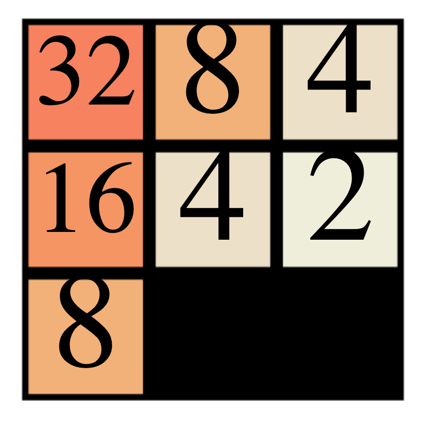

# elm2048
Old version of Elm, 2048 game. Based on code originally posted as a gist by @JoeyEremondi.

Try out the variants:
* [Basic version - Keyboard or touch gestures](https://vertexcite.github.io/elm2048/2048-touch-test/demo.html)
* [Instant gratification 3x3 version](https://vertexcite.github.io/elm2048/2048-3x3/game2048-Elm.html)
* [**Undo** button, you've always wanted!](https://vertexcite.github.io/elm2048/2048-with-undo/game2048-Elm.html)

